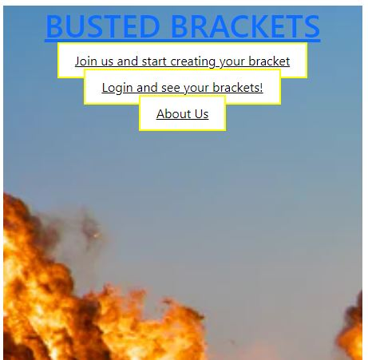

# Busted Brackets

## Description:
A user interactive website to generate brackets. By selecting different types of brackets the user can generate a bracket for any tournament they desire. 

Built With: 
* react
* apollo-server-express
* bcrypt
* express
* faker
* graphql
* jsonwebtoken
* mongoose
* bootstrap

## Table of Contents
* [Installation](#installation)
* [Usage](#usage)
* [Credits](#credits)

## Installation
1. In the project folder run npm install
2. CD into client file and run npm run build 
3. Run npm start to run application locally

## Usage
Users can create a profile to being enjoying the Busted Brackets experience. When users have signed up they can join a bracket or create a bracket. When creating a bracket users can populate the first round of available teams to have the winning teams navigate through the bracket. 

## Credits
* Adam Olson - https://github.com/adamlsn
* Devon Ross - https://github.com/dr-50
* Kaan Nazlioz - https://github.com/nazliozemrek
* Luca Wicklund - https://github.com/csr-ph

## Website:
Github Repo - https://limitless-wildwood-05739.herokuapp.com/
https://github.com/adamlsn/busted-brackets

Live Site -